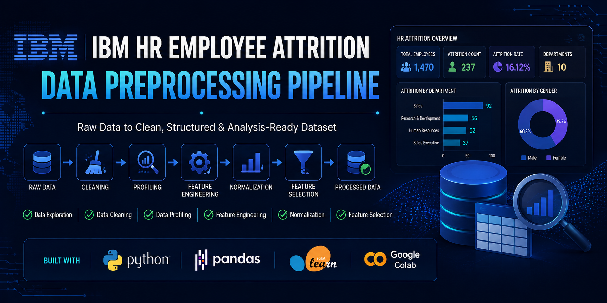

<p align="center">
  
</p>

<h1 align="center">🚀 IBM HR Employee Attrition Data Preprocessing</h1>

<p align="center">
A complete end-to-end <b>Data Engineering</b> preprocessing pipeline built using the IBM HR Employee Attrition dataset.
</p>

<p align="center">


</p>

---

# 📖 Project Overview

This project demonstrates an end-to-end data preprocessing workflow performed on the IBM HR Employee Attrition dataset.

The objective is to transform raw HR data into a clean, structured, feature-rich, and analysis-ready dataset using standard Data Engineering preprocessing techniques.

---

# 🎯 Objectives

✔ Explore the dataset

✔ Perform Data Profiling

✔ Identify Missing Values

✔ Detect Duplicate Records

✔ Analyze Numerical Features

✔ Detect Outliers

✔ Create New Features

✔ Normalize Numerical Features

✔ Perform Feature Selection

✔ Export Final Processed Dataset

---

# 🗂 Dataset Information

**Dataset:** IBM HR Analytics Employee Attrition

**Records:** 1470

**Original Features:** 35

**Processed Features:** 33

---

# ⚙️ Project Workflow

## 🔹 Data Exploration

- Dataset Shape
- Data Types
- Basic Statistics

---

## 🔹 Data Profiling

- Missing Values
- Duplicate Detection
- Constant Columns
- Categorical Analysis
- Numerical Analysis

---

## 🔹 Outlier Detection

- Boxplots
- Distribution Analysis
- IQR-based Identification

---

## 🔹 Feature Engineering

Created new features including:

- ⭐ TotalSatisfactionScore
- ⭐ YearsWorkedOutsideCompany

---

## 🔹 Data Normalization

Applied:

✅ Min-Max Scaling

to numerical features.

---

## 🔹 Feature Selection

Removed:

- EmployeeNumber

because it is a unique identifier and provides no analytical value.

---

# 📊 Technologies Used

🐍 Python

🐼 Pandas

📊 Matplotlib

🤖 Scikit-Learn

📒 Google Colab

🌐 GitHub

---

# 📁 Repository Structure

```
IBM-HR-Data-Preprocessing/

│── IBM_HR_Preprocessing.ipynb
│── IBM_HR_Processed_Data.csv
│── WA_Fn-UseC_-HR-Employee-Attrition.csv
│── banner.png
│── README.md
```

---

# 📈 Final Outcome

✔ Clean Dataset

✔ Feature Engineered Dataset

✔ Normalized Dataset

✔ Selected Features

✔ Ready for Dashboard Development

✔ Ready for Machine Learning

---

# 🌟 Key Skills Demonstrated

- Data Profiling
- Data Cleaning
- Feature Engineering
- Feature Selection
- Data Normalization
- Exploratory Data Analysis
- Python Programming
- Pandas
- Scikit-Learn
- Data Engineering Workflow

---

# ⭐ If you like this project

Give this repository a ⭐ and feel free to fork it!

---
